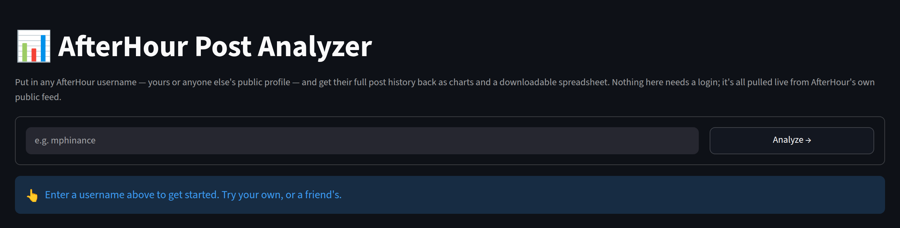
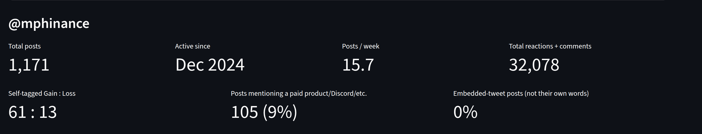
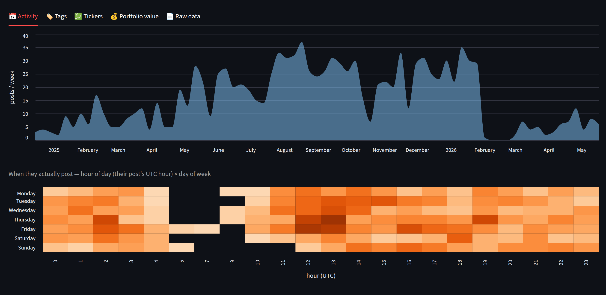
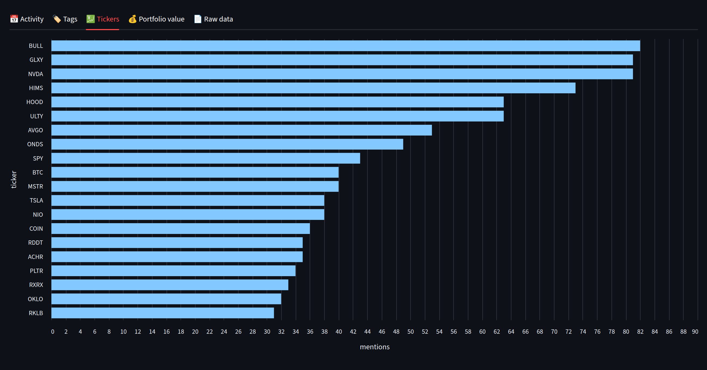
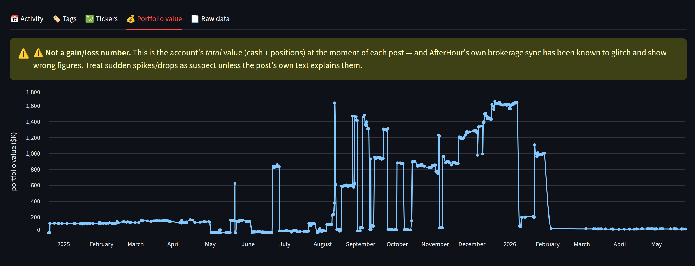
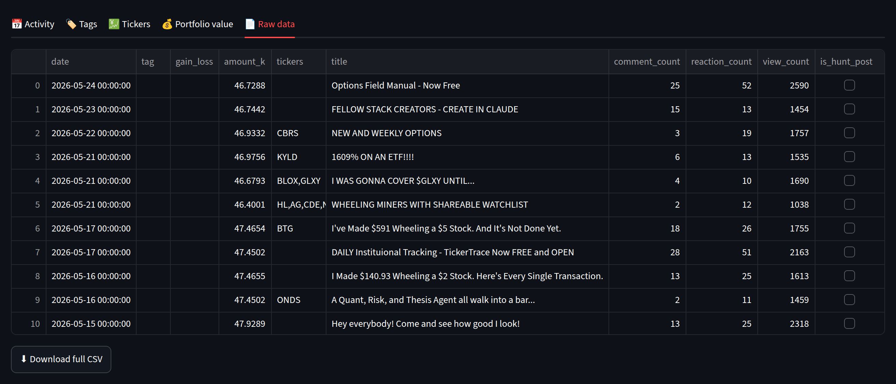

# AfterHour Post Analyzer

[](https://github.com/mphinance/afterhour-export/actions/workflows/ci.yml)

Type in an AfterHour username, get their whole post history back as charts and a
downloadable CSV. No login, no API key — AfterHour's post feed is public.



**Live app:** deploy this repo on [Streamlit Community Cloud](https://streamlit.io/cloud)
pointed at `streamlit_app.py`, or run it yourself:

```bash
pip install -r requirements.txt
streamlit run streamlit_app.py
```

## What it shows

Every screenshot below is a real run against `@mphinance`'s public profile — 1,171
posts going back to December 2024.

Headline numbers first: how much they post, how much engagement it draws, how often
they tag their own posts as wins versus losses, and how much of it points at
something paid.



Posting activity over time, plus a day/hour heatmap of when they actually post:



Most-mentioned tickers:



Portfolio value over time — **flagged as unreliable** right in the app, because
AfterHour's brokerage sync has been known to glitch. It's also a *total account
value*, not a profit number:



And the full table behind all of it, with a CSV export of every field:



There's also a Tags tab breaking down Gain/Loss/Discuss/DD/etc. — self-selected by
the poster, not verified by anyone.

## Just want the data, not the dashboard?

Standalone script, no Streamlit needed:
https://gist.github.com/mphinance/8be410783fe65efe3894198f88388d2a

```bash
python3 fetch_my_afterhour_posts.py --username YourHandle
```

## Development

```bash
pip install -r requirements-dev.txt
pytest          # unit tests — no network, the feed API is stubbed
ruff check .    # lint
```

- `afterhour.py` — the feed client: fetching, cursor pagination, normalization.
- `streamlit_app.py` — the UI, charts, and CSV export.

They're split so the client can be imported and tested on its own; importing the
app module would otherwise boot the whole Streamlit page.

CI runs the tests and lint on Python 3.10–3.13, plus a smoke check that the app
actually boots. Nothing in CI touches the network.

## How the data source works

`afterhour.com/<username>`'s post feed is powered by a public, unauthenticated API:

```
https://api.afterhour.com/social/feed?take=50&contentTypes=post&authorId=<prf_id>
```

Page through with the response's `cursor` field to get everything. The app handles
that automatically, along with two quirks worth knowing about:

- **`take` is capped at 100, but 100 doesn't actually work.** The first page returns
  fine; every *cursor* page after it hits a 504 Gateway Timeout essentially every
  time. 50 is the largest page size that paginates reliably.
- **504s happen intermittently even at 50** — roughly one request in seven. They're
  transient, so the app retries the same cursor with exponential backoff, and falls
  back to a smaller page size if a page still won't load. The cursor is independent
  of `take`, so shrinking mid-run resumes at exactly the right spot with no gaps or
  duplicates.
